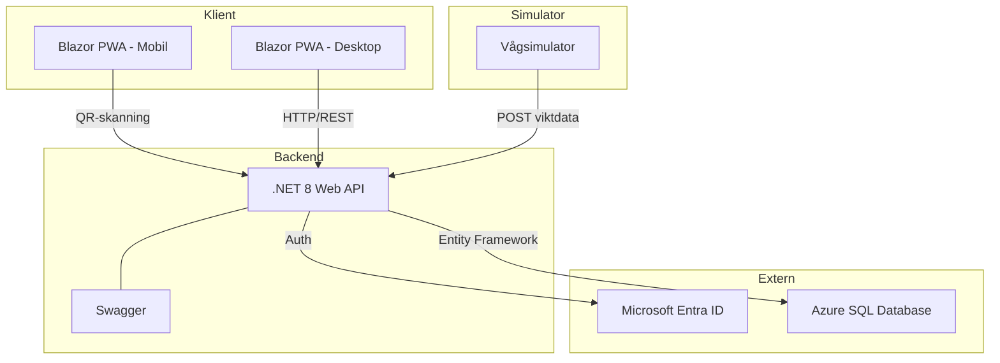

# InventoryManagementProgram
An inventory management system for bigger restaurant and hotels.
## Systemarkitektur

## Techstack

- **Backend:** C# / .NET 8 Web API
- **Frontend:** Blazor WebAssembly (PWA)
- **Database:** Azure SQL Database
- **ORM:** Entity Framework Core
- **Auth:** Microsoft Entra ID
- **API-documentation:** Swagger
- **Testing:** xUnit, Postman
- **Versionshantering:** GitHub
- **Simulator:** Konsolapp för att simulera nätverksvågar
